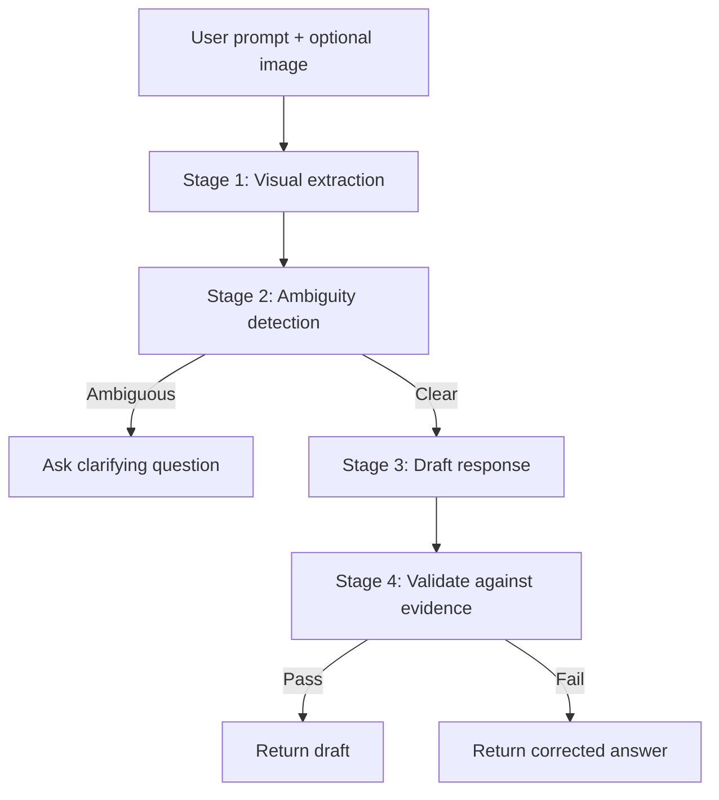

# Multi-Modal Agentic Assistant

Streamlit chat app powered by **Google Gemini** that runs a **4-stage agentic pipeline** over text and image inputs — grounding, ambiguity detection, drafting, and fact-checking.

> **Note:** This repo replaces an older local TensorFlow/NLTK/Tkinter chatbot concept. The current implementation is API-based multimodal reasoning, not on-device Keras training.

## Tech stack

| Layer | Tools |
| --- | --- |
| UI | [Streamlit](https://streamlit.io/) |
| Model | [Google Gemini](https://ai.google.dev/) (`gemini-2.5-flash`) via `google-genai` |
| Images | Pillow |
| Config | `python-dotenv` |

## Project structure

```
genAI_chatbot/
├── app.py              # Streamlit chat UI and session state
├── pipeline.py         # MultimodalPipeline — 4-stage reasoning
├── requirements.txt
├── .env.example        # Copy to .env and add your API key
└── README.md
```

## The 4-stage reasoning pipeline



1. **Visual extraction (grounding)** — If an image is attached, Gemini extracts literal facts (OCR, objects, layout). This becomes ground-truth evidence.
2. **Ambiguity detection** — Checks whether the prompt is answerable from chat history and visual evidence. Vague prompts (e.g. “What is this?”) stop the pipeline and trigger a clarifying question.
3. **Draft reasoning** — Synthesizes context, evidence, and the user prompt into a draft answer constrained to known facts.
4. **Validation (fact-checking)** — A validator compares the draft to extracted evidence. Hallucinations are rewritten; supported drafts pass through.

Internal stage logs appear in the Streamlit sidebar under **Agent Pipeline Thoughts**.

## Setup

**Requirements:** Python 3.10+ recommended, Gemini API key from [Google AI Studio](https://aistudio.google.com/).

```bash
git clone https://github.com/vhemanthkum/genAI_chatbot.git
cd genAI_chatbot
python -m venv venv

# Windows
venv\Scripts\activate
# macOS / Linux
# source venv/bin/activate

pip install -r requirements.txt
copy .env.example .env   # Windows
# cp .env.example .env   # macOS / Linux
```

Edit `.env`:

```env
GEMINI_API_KEY=your_actual_key_here
```

Run the app:

```bash
streamlit run app.py
```

## Try it

1. Open the sidebar to watch pipeline logs.
2. Upload a chart or busy scene (optional).
3. Send an ambiguous prompt like “What is this?” — Stage 2 should ask for clarification.
4. Ask something specific — Stages 1, 3, and 4 run end to end.

## Environment variables

| Variable | Required | Description |
| --- | --- | --- |
| `GEMINI_API_KEY` | Yes | Google AI Studio API key for Gemini |

## License

MIT — use and modify freely.
