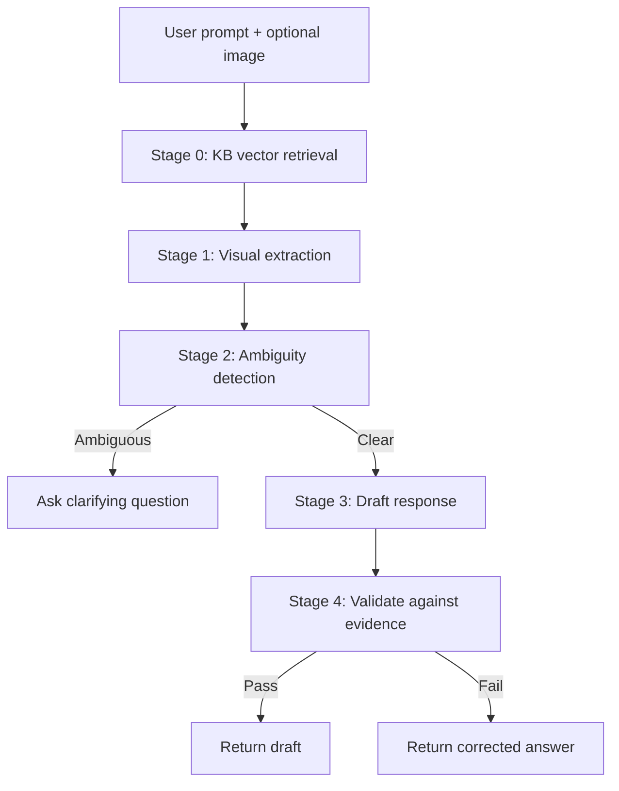

# Multi-Modal Agentic Assistant

Streamlit chat app extending the **NullClass Gen AI training chatbot** ([training repo](https://github.com/vhemanthkum/NullClass_Chatbot)). It runs a **5-stage agentic pipeline** over text and image inputs, with a **dynamically expanding vector knowledge base** that refreshes automatically from configured sources.

> **Note:** This project builds directly on the training chatbot's hybrid architecture (Keras intent model + ChromaDB RAG). The internship extension adds multimodal Gemini reasoning, ambiguity handling, response validation, and periodic KB ingestion — not a separate unrelated project.

## Problem statement

Customer-facing AI assistants must do more than call a single LLM endpoint. They need to:

1. **Ground answers in facts** from a domain knowledge base that grows over time.
2. **Reason over images** (charts, screenshots, diagrams) without hallucinating visual details.
3. **Handle ambiguous queries** by asking clarifying questions instead of guessing.
4. **Validate responses** against retrieved evidence before returning them to the user.

**Objective:** Extend the NullClass training chatbot into a multimodal assistant that combines dynamic RAG, visual extraction, contextual drafting, and fact-checking in one reproducible pipeline.

---

## Dataset

| Source | Type | Purpose |
| --- | --- | --- |
| `intents.json` (training project) | Structured JSON | Intent classification for conversational flow |
| `knowledge_base/docs/nullclass_faq.txt` | Unstructured FAQ | Domain facts about NullClass programs |
| `knowledge_base/docs/assistant_pipeline.txt` | Unstructured docs | System documentation for the assistant itself |
| `knowledge_base/eval_queries.json` | Evaluation set | Fixed queries for RAG retrieval benchmarking |
| User-uploaded images | Multimodal input | Visual grounding via Gemini OCR/object extraction |

Knowledge sources are declared in `knowledge_base/sources.json`. Add local files or URLs there; the updater ingests them without retraining any model.

---

## Methodology

### Preprocessing & feature engineering

1. **Text chunking:** Documents are sanitized (Unicode normalization) and split into ~300-character overlapping chunks to preserve semantic context across paragraph boundaries.
2. **Embeddings:** Chunks are embedded locally with `sentence-transformers/all-MiniLM-L6-v2` and stored in ChromaDB with cosine similarity.
3. **Visual grounding:** When an image is attached, Gemini extracts literal facts (OCR, objects, layout) as structured evidence — separate from KB retrieval.

### Model selection (baseline vs advanced)

| Approach | Architecture | Role |
| --- | --- | --- |
| **Baseline (training project)** | Keras dense network + keyword heuristics | Intent routing; no semantic KB retrieval |
| **Advanced (this project)** | ChromaDB + sentence-transformers RAG | Semantic retrieval injected into pipeline Stages 0, 2, 3, 4 |
| **Reasoning layer** | Google Gemini (`gemini-2.5-flash`) | Ambiguity detection, drafting, validation, visual extraction |

The assistant does **not** rely on single-shot LLM output. Each user message passes through structured stages with logged intermediate reasoning.

### The 5-stage reasoning pipeline



| Stage | Name | Description |
| --- | --- | --- |
| 0 | **KB retrieval (RAG)** | Semantic search over ChromaDB; top chunks within distance cutoff become factual context |
| 1 | **Visual extraction** | Gemini extracts literal image facts as ground-truth evidence |
| 2 | **Ambiguity detection** | Halts pipeline on vague prompts; returns clarifying question |
| 3 | **Draft reasoning** | Synthesizes chat history, KB context, and visual evidence |
| 4 | **Validation** | Fact-checks draft; rewrites unsupported claims |

### Dynamic knowledge base updates

`kb_updater.py` reads `knowledge_base/sources.json`, fetches enabled sources (local files or URLs), chunks text, and upserts into ChromaDB.

- **Automatic:** Background scheduler runs every 30 minutes (configurable via `KB_UPDATE_INTERVAL_MINUTES`).
- **Manual:** Sidebar button in Streamlit, or `python kb_updater.py` for a full re-index.
- **Incremental:** Content-hash IDs prevent duplicate chunks; `full_reindex=True` clears and rebuilds.

---

## Results & visualizations

Run the evaluation script after seeding the knowledge base:

```bash
python evaluate_rag.py
```

This generates:

| File | Description |
| --- | --- |
| `visualizations/rag_retrieval_accuracy.png` | Pie chart + distance histogram for top-1 retrieval |
| `visualizations/baseline_vs_rag_comparison.png` | Baseline keyword heuristic vs semantic RAG hit rate |

Example output (local run):

- **RAG retrieval accuracy:** 92% on 13 eval queries (cutoff 0.55, mean distance 0.25)
- **Baseline keyword heuristic:** 85% on the same queries
- Semantic vector search handles paraphrased questions better than literal token overlap

Training-project visualizations (Keras intent model from the base chatbot) are included in `visualizations/`:

| File | Description |
| --- | --- |
| `visualizations/training_history.png` | Keras intent classifier accuracy/loss curves |
| `visualizations/confusion_matrix.png` | Intent classification confusion matrix |

---

## Tech stack

| Layer | Tools |
| --- | --- |
| UI | [Streamlit](https://streamlit.io/) |
| Reasoning | [Google Gemini](https://ai.google.dev/) (`gemini-2.5-flash`) via `google-genai` |
| Vector DB | [ChromaDB](https://www.trychroma.com/) + `sentence-transformers` |
| Images | Pillow |
| Evaluation | Matplotlib, NumPy |
| Config | python-dotenv |

---

## Project structure

```
genAI_chatbot/
├── app.py                          # Streamlit chat UI + KB sidebar
├── pipeline.py                     # 5-stage multimodal reasoning pipeline
├── vector_store.py                 # ChromaDB wrapper
├── kb_updater.py                   # Periodic KB ingestion scheduler
├── evaluate_rag.py                 # RAG evaluation + visualization generator
├── knowledge_base/
│   ├── sources.json                # Configured ingestion sources
│   ├── eval_queries.json           # Retrieval benchmark queries
│   └── docs/                       # Local knowledge documents
├── visualizations/                 # Generated eval plots
├── requirements.txt
├── .env.example
└── README.md
```

---

## Setup

**Requirements:** Python 3.10+, Gemini API key from [Google AI Studio](https://aistudio.google.com/).

```bash
git clone https://github.com/vhemanthkum/genAI_chatbot.git
cd genAI_chatbot
python -m venv venv

# Windows
venv\Scripts\activate
# macOS / Linux
# source venv/bin/activate

pip install -r requirements.txt
copy .env.example .env   # Windows
# cp .env.example .env   # macOS / Linux
```

Edit `.env`:

```env
GEMINI_API_KEY=your_actual_key_here
```

Seed the knowledge base and run evaluation:

```bash
python kb_updater.py
python evaluate_rag.py
```

Run the app:

```bash
streamlit run app.py
```

---

## Try it

1. Open the sidebar — confirm **Indexed chunks** count and last update time.
2. Ask a domain question: *"What courses does NullClass offer?"* — Stage 0 should retrieve KB context.
3. Upload a chart or busy scene and ask something specific — Stages 1, 3, and 4 run end to end.
4. Send an ambiguous prompt like *"What is this?"* — Stage 2 should ask for clarification.
5. Click **Refresh Knowledge Base** after editing files in `knowledge_base/docs/`.

---

## Environment variables

| Variable | Required | Default | Description |
| --- | --- | --- | --- |
| `GEMINI_API_KEY` | Yes | — | Google AI Studio API key |
| `KB_UPDATE_INTERVAL_MINUTES` | No | `30` | Auto-refresh interval |
| `KB_SIMILARITY_CUTOFF` | No | `0.55` | Max cosine distance for relevant chunks |
| `KB_CHUNK_SIZE` | No | `300` | Characters per chunk |
| `KB_CHUNK_OVERLAP` | No | `50` | Chunk overlap |
| `CHROMA_DIR` | No | `chroma_db` | Persistent vector store path |

---

## Adding new knowledge sources

Edit `knowledge_base/sources.json`:

```json
{
  "type": "file",
  "path": "knowledge_base/docs/my_new_doc.txt",
  "description": "My new documentation",
  "enabled": true
}
```

Or add a URL source:

```json
{
  "type": "url",
  "url": "https://example.com/docs",
  "description": "External documentation",
  "enabled": true
}
```

The next scheduled update (or manual refresh) will ingest the new content automatically.

---

## License

MIT — use and modify freely.
